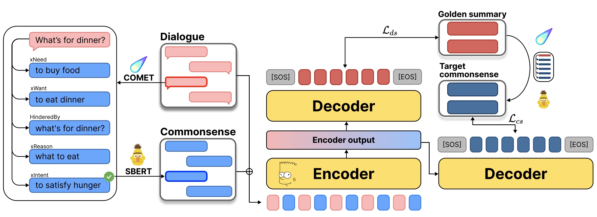

# Mind the Gap! Injecting Commonsense Knowledge for Abstractive Dialogue Summarization
The official repository for the paper "Mind the Gap! Injecting Commonsense Knowledge for Abstractive Dialogue Summarization" accepted at COLING 2022.

Paper Link : https://arxiv.org/abs/2209.00930

Overview of method, SICK (Summarizing with Injected Commonsense Knowledge).
<p align="center">
  
</p>

## Setting
The following command will clone the project:
```
git clone https://github.com/SeungoneKim/SICK_Summarization.git
```

Before experimenting, you can make a virtual environment for the project.
```
conda create -n sick python=3.8
conda activate sick
pip install torch==1.10.1+cu113 torchvision==0.11.2+cu113 torchaudio==0.10.1 -f https://download.pytorch org/whl/cu113/torch_stable.html
pip install -r requirements.txt
pip install -U spacy
python -m spacy download en_core_web_sm
```

## Dataset download
For training and evaluating on Samsum, we use dataset provided by [Hugging Face Dataset Library](https://github.com/huggingface/datasets). For Dialogsum, the dataset is not automatically provided, so you can download it from the url below,
```
mkdir data/DialogSum_data
```
and put it under the directory of SICK_summarization/data/DialogSum_data.
```
mkdir data/DialogSum_data
```
under the root directory. Put your downloaded dataset under the data directory in order to proceed the experiment.\
For prompts of NLP tasks, we use toolkit provided by [BigScience](https://github.com/bigscience-workshop/promptsource). They are easily applied to huggingface datasets, which are implemented in our code.\
We also use subset of [BIG-bench](https://github.com/google/BIG-bench) benchmarks for our evaluation.

```
CUDA_VISIBLE_DEVICES="1" python3 train_summarization_full.py --finetune_weight_path="./new_weights_paracomet" --best_finetune_weight_path="./new_weights_paracomet_best" --dataset_name="samsum" --use_paracomet=True --model_name="facebook/bart-large-xsum" --relation "xIntent" --supervision_relation "xIntent" --epoch=1 --use_sentence_transformer True
```

```
CUDA_VISIBLE_DEVICES="1" python3 inference.py --dataset_name "samsum" --model_checkpoint="./new_weights_paracomet_best" --test_output_file_name="./tmp_result.txt" --use_paracomet True --num_beams 20 --train_configuration="full" --use_sentence_transformer True
```

## Released checkpoints
We recommend using the [FLIPPED-11B](seonghyeonye/flipped_11B) checkpoint as it leads (on average) to the best performances on a variety of NLP tasks.
|Model|Number of parameters|
|-|-|
|[Flipped_11B](https://huggingface.co/seonghyeonye/flipped_11B)|11 billion|
|[Flipped_3B](https://huggingface.co/seonghyeonye/flipped_3B)|3 billion|

Here is how to download the model in PyTorch:

```python
import torch
from transformers import T5Tokenizer, T5ForConditionalGeneration

model = T5ForConditionalGeneration.from_pretrained("seonghyeonye/flipped_11B")
tokenizer = T5Tokenizer.from_pretrained("seonghyeonye/flipped_11B")
```
If you want to use another checkpoint, please replace the path in `T5Tokenizer` and `T5ForConditionalGeneration`.

## Quick start
We provide a quick [Jupyter notebook](./flipped_inference.ipynb) with explanation where you can test the inference of FLIPPED.
## Training&evaluation
We provide commands for all our experiments in README.md under T0 directory. Check [this](./T0/README.md) out!


## Citation
If you find this useful, please consider citing our paper:
```
@article{ye2022guess,
  title={Guess the Instruction! Flipped Learning Makes Language Models Stronger Zero-Shot Learners},
  author={Ye, Seonghyeon and Kim, Doyoung and Jang, Joel and Shin, Joongbo and Seo, Minjoon},
  journal={arXiv preprint arXiv:2210.02969},
  year={2022}
}
```  

